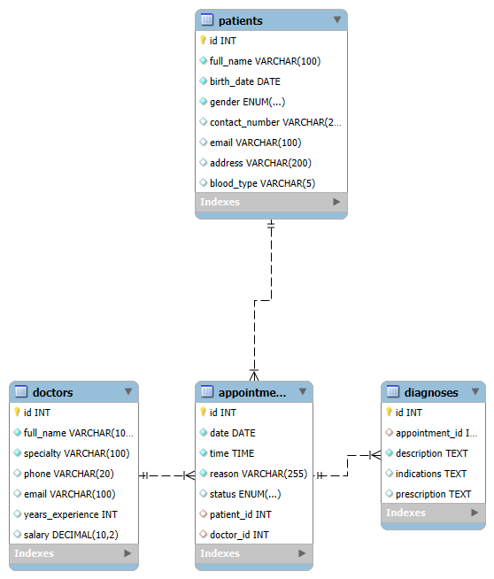

# Medical Appointment Management System

A simple web-based system for managing patients, doctors, appointments, and diagnoses. Built with Node.js, Express, MySQL, and a clean HTML/CSS/JS frontend.

---

## Features

- Register patients and doctors
- Schedule and update appointments
- Record diagnoses for completed appointments
- Simple, user-friendly web interface

---

## Prerequisites

- **Node.js** (v14 or higher recommended)
- **MySQL Server** (with Workbench or any MySQL client)

---

## Database Schema (SQL)

```sql
CREATE DATABASE IF NOT EXISTS vida_sana;
USE vida_sana;

CREATE TABLE IF NOT EXISTS patients (
    id INT AUTO_INCREMENT PRIMARY KEY,
    full_name VARCHAR(100) NOT NULL,
    birth_date DATE NOT NULL,
    gender ENUM('M','F','Other') NOT NULL,
    contact_number VARCHAR(20),
    email VARCHAR(100),
    address VARCHAR(200),
    blood_type VARCHAR(5)
);

CREATE TABLE IF NOT EXISTS doctors (
    id INT AUTO_INCREMENT PRIMARY KEY,
    full_name VARCHAR(100) NOT NULL,
    specialty VARCHAR(100) NOT NULL,
    phone VARCHAR(20),
    email VARCHAR(100),
    years_experience INT,
    salary DECIMAL(10,2)
);

CREATE TABLE IF NOT EXISTS appointments (
    id INT AUTO_INCREMENT PRIMARY KEY,
    date DATE NOT NULL,
    time TIME NOT NULL,
    reason VARCHAR(255) NOT NULL,
    status ENUM('pending','completed','canceled') DEFAULT 'pending',
    patient_id INT,
    doctor_id INT,
    FOREIGN KEY (patient_id) REFERENCES patients(id),
    FOREIGN KEY (doctor_id) REFERENCES doctors(id)
);

CREATE TABLE IF NOT EXISTS diagnoses (
    id INT AUTO_INCREMENT PRIMARY KEY,
    appointment_id INT,
    description TEXT NOT NULL,
    indications TEXT,
    prescription TEXT,
    FOREIGN KEY (appointment_id) REFERENCES appointments(id)
);
```

---

## Relational Model

### patients

- id (PK)
- full_name
- birth_date
- gender
- contact_number
- email
- address
- blood_type

### doctors

- id (PK)
- full_name
- specialty
- phone
- email
- years_experience
- salary

### appointments

- id (PK)
- date
- time
- reason
- status (pending, completed, canceled)
- patient_id (FK → patients.id)
- doctor_id (FK → doctors.id)

### diagnoses

- id (PK)
- appointment_id (FK → appointments.id)
- description
- indications
- prescription

---

## Entity-Relationship Diagram (Textual)

```
[patients]      [doctors]
    |               |
    |               |
    +-----<appointments>-----+
                  |
                  |
             [diagnoses]
```

- A patient can have many appointments.
- A doctor can have many appointments.
- An appointment belongs to one patient and one doctor.
- An appointment can have one diagnosis (only when completed).
- A diagnosis is linked to one appointment.

---

## Entity-Relationship Diagram (Graphical)



---

## Setup Instructions

### 1. Clone or copy the project folder

### 2. Install backend dependencies

```bash
npm install
```

### 3. Set up the MySQL database

- Open MySQL Workbench (or your preferred client)
- Run the contents of `db/schema.sql` to create the `vida_sana` database and tables
- Make sure to note your MySQL username and password

### 4. Configure backend connection

- Edit `index.js` and update the `user` and `password` fields in the MySQL connection section to match your MySQL credentials:

```js
const db = mysql.createConnection({
  host: "localhost",
  user: "your_mysql_user",
  password: "your_mysql_password",
  database: "vida_sana",
});
```

### 5. Start the backend server

```bash
npm start
```

- The backend will listen on `http://localhost:3001`

### 6. Serve the web interface

- The simplest way is to open `public/index.html` directly in your browser (for local testing)
- **Recommended:** Serve the `public` folder with a static server. You can use [live-server](https://www.npmjs.com/package/live-server) or add static serving to Express:

#### To serve with Express (add to `index.js` before your routes):

```js
app.use(express.static("public"));
```

Then open `http://localhost:3001` in your browser.

---

## API Endpoints

- `POST /patients` — Register a new patient
- `POST /doctors` — Register a new doctor
- `POST /appointments` — Schedule a new appointment
- `PUT /appointments/:id/status` — Update appointment status
- `POST /diagnoses` — Record a diagnosis for a completed appointment

All endpoints accept and return JSON.

---

## Notes

- If you encounter CORS issues, make sure to serve the frontend from the same domain/port as your backend, or use the included CORS middleware.
- All code, comments, and interface are in English.
- For any issues, check your terminal and browser console for error messages.

---
